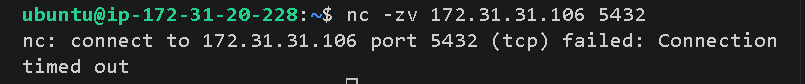
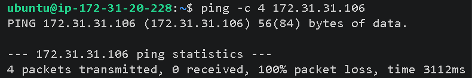

# Cloud Troubleshooting Series (CTS-02)

# Database Connection Refused

Production Incident Response • AWS Infrastructure • Linux Troubleshooting • PostgreSQL Connectivity

---

# Incident Overview

This project simulates a real-world production outage where a customer-facing web application is unable to communicate with its backend PostgreSQL database.

The objective is to investigate the infrastructure layer by layer, identify the root cause of the connectivity failure, restore service availability, and document the complete incident response process.

---

# Incident Information

| Item | Details |
|------|---------|
| Incident ID | CTS-02 |
| Severity | P1 – Critical |
| Category | Database Connectivity |
| Environment | Production |
| Region | ap-southeast-1 (Singapore) |
| Company | NovaRetail Sdn. Bhd. |
| Assigned Engineer | Fadzlan Omar |
| Current Status | Resolved |

---

# Business Impact

### Affected Service

Customer Portal

### Customer Symptoms

- Unable to login
- Product checkout unavailable
- User authentication failed
- Application returned **Database Connection Refused**

---

# Production Alert

## CloudWatch Notification

```
ALERT

Service : Customer Portal

Status  : CRITICAL

Error   : Database Connection Refused
```

---

## Customer Support Escalation

```
Customer Support Team

Hi Cloud Team,

Customers are unable to login into the Customer Portal.

The application displays:

Database Connection Refused

Please investigate immediately.
```

---

# Infrastructure Architecture

```
                    Internet
                        │
                        ▼
          Application Load Balancer
                        │
                        ▼
            EC2 Web Server (Ubuntu)
                        │
             PostgreSQL TCP Port 5432
                        │
                        ▼
       EC2 PostgreSQL Database Server
```

---

# Infrastructure Components

## Application Tier

| Resource | Description |
|----------|-------------|
| EC2 Ubuntu Server | Hosts customer web application |
| Application Load Balancer | Routes HTTP traffic |
| Security Group | Controls inbound application access |

---

## Database Tier

| Resource | Description |
|----------|-------------|
| EC2 Ubuntu Server | Dedicated PostgreSQL Server |
| PostgreSQL | Primary production database |
| Security Group | Controls database connectivity |

---

# Network Security Configuration

## Web Server Security Group

| Protocol | Port | Purpose |
|----------|------|---------|
| HTTP | 80 | Public Web Access |
| SSH | 22 | Administrative Access |

---

## Database Security Group

| Protocol | Port | Purpose |
|----------|------|---------|
| SSH | 22 | Administrative Access |
| PostgreSQL | 5432 | Database Communication |

---

# Investigation Strategy

The investigation follows a structured troubleshooting methodology by validating every infrastructure layer individually.

```
Customer Report
       │
       ▼
Verify Web Server
       │
       ▼
Verify Network Connectivity
       │
       ▼
Verify Security Groups
       │
       ▼
Verify PostgreSQL Service
       │
       ▼
Identify Root Cause
       │
       ▼
Recover Service
       │
       ▼
Validate Application
```

---

# Phase 1 — Initial Assessment

The web application was reachable, however all database transactions failed.

This confirmed that the issue existed between the Application Tier and Database Tier rather than at the Load Balancer.


---

# Phase 2 — Connectivity Verification

Login to the application server.

Verify whether TCP Port **5432** is reachable.

```bash
nc -zv <database-private-ip> 5432
```

Expected Output

```
Connection refused
```

This confirms the database service is not accepting incoming connections.

---

# Phase 3 — Infrastructure Investigation

The following components are inspected in sequence.

- EC2 Instance Status
- Security Groups
- Route Tables
- Network ACLs
- PostgreSQL Service
- PostgreSQL Listener
- PostgreSQL Configuration
- Linux Firewall
- System Logs

---

# Linux Commands Executed

```bash
hostname

ip addr

ping <database-private-ip>

nc -zv <database-private-ip> 5432

systemctl status postgresql

ss -tulnp

journalctl -u postgresql

cat /etc/postgresql/*/main/postgresql.conf

cat /etc/postgresql/*/main/pg_hba.conf

sudo ufw status

sudo systemctl restart postgresql
```

---

# Root Cause Analysis

After validating each infrastructure component, the failure was isolated to the PostgreSQL service layer.

Possible causes investigated included:

- PostgreSQL service stopped
- Database not listening on Port 5432
- Incorrect listen_addresses configuration
- Missing pg_hba.conf rule
- Security Group misconfiguration
- Local firewall blocking traffic

The identified root cause is documented within the incident report.

---

# Recovery Procedure

Recovery actions included:

- Restart PostgreSQL service
- Correct PostgreSQL configuration
- Verify listener binding
- Confirm Security Group rules
- Validate TCP connectivity
- Test application connectivity
- Monitor recovery through CloudWatch

---

# Validation

After recovery:

- PostgreSQL Port 5432 reachable
- Customer Portal operational
- User authentication restored
- CloudWatch alarms cleared
- Database responding normally

---

# AWS Services Used

- Amazon EC2
- Amazon VPC
- Security Groups
- Application Load Balancer
- CloudWatch
- IAM
- PostgreSQL
- Ubuntu Linux

---

# Skills Demonstrated

- Linux System Administration
- PostgreSQL Administration
- AWS Networking
- Security Group Troubleshooting
- Infrastructure Diagnostics
- Production Incident Response
- Root Cause Analysis
- Cloud Infrastructure Recovery
- Layer 4 Network Troubleshooting
- Documentation and Incident Reporting

---

# Lessons Learned

- Always isolate failures layer by layer instead of making assumptions.
- Validate infrastructure before modifying configurations.
- Network reachability does not guarantee application availability.
- PostgreSQL configuration should always be verified after deployment.
- Proper documentation significantly reduces future incident resolution time.

---

# Repository Structure

```
CTS-02-Database-Connection-Refused
│
├── terraform/
├── app/
├── incident/
├── screenshots/
├── README.md
└── .gitignore
```
